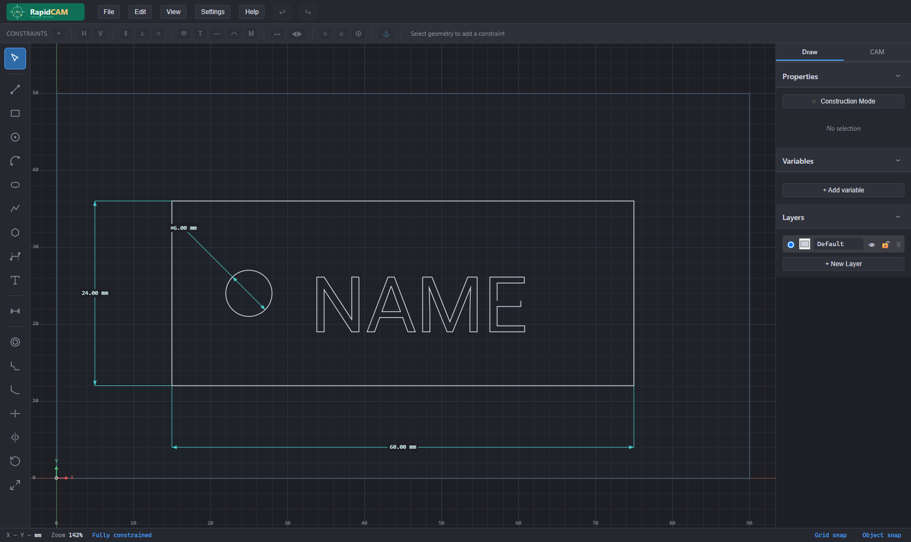
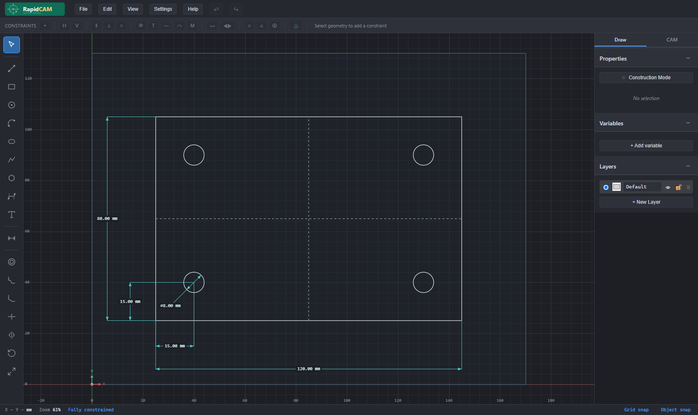
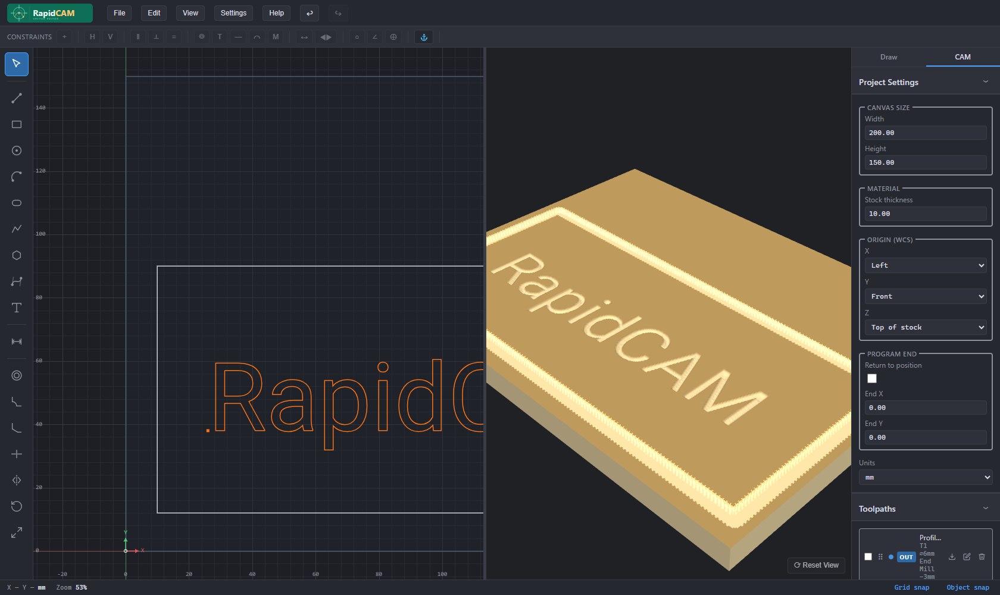

# RapidCAM

**Open-source CAD/CAM for desktop CNC — right in your browser.**

Sketch a part, lock it down with real parametric constraints, generate toolpaths, and export GRBL or LinuxCNC G-code. No install, no account, no upload — your designs and G-code never leave your browser.

### 👉 [Try it now at rapidcam.app](https://rapidcam.app) — nothing to install

| Sketch editor | Constraint solver | CAM toolpaths |
|---|---|---|
|  |  |  |

**Why RapidCAM?**

- **Runs anywhere** — it's a web app. Open it on any machine, no setup.
- **Truly parametric** — a Levenberg-Marquardt constraint solver, driving dimensions, and variables, so edits stay consistent (not just a drawing program).
- **From sketch to G-code in one place** — profile, pocket, engrave, drill, and V-carve toolpaths with a 3D cut preview.
- **Private by default** — all processing is local; your files stay on your machine. Analytics is opt-in only.
- **Open source** — AGPL-3.0, with a commercial license available.

---

## Feature overview

### Drawing tools

| Tool | Key | Description |
|------|-----|-------------|
| Select | `V` | Click/drag to select; move, resize, or rotate selected entities |
| Line | `L` | Click two points; chains automatically |
| Rectangle | `R` | Click two corners |
| Circle | `C` | Click centre then a point on the circumference |
| Arc | `A` | Click centre, start, end |
| Slot | `U` | Click two centre points; auto-constrains the two arc caps |
| Polygon | `N` | Click centre then a vertex; `[`/`]` change side count |
| Polyline | `P` | Click vertices; `Enter` to close; open or closed |
| Bezier | `B` | Click four control points (cubic) |
| Text | — | Click to place; double-click to edit in place; outlines can be profiled, pocketed, engraved, or **v-carved** |
| Dimension | `D` | Click an entity to annotate; drag the witness line |
| Offset | `O` | Click an entity to offset inward or outward |
| Fillet | `F` | Click a sharp corner to round it with a user-typed radius |
| Chamfer | — | Click a sharp corner to bevel it with a user-typed distance |
| Trim | `T` | Click the segment to remove at an intersection |
| Mirror | `M` | Reflect selected entities across a picked axis line |
| Rotate | `Q` | Rotate selected entities by angle around a pivot |
| Scale | `S` | Scale selected entities by factor around a pivot |

### Parametric constraint solver

RapidCAM uses a **Levenberg-Marquardt** solver with Tikhonov regularisation. Non-pinned degrees of freedom are always anchored so that editing a driving dimension produces a minimal-movement solution (no unexpected rotations).

**Available constraints** (applied from the constraint bar or automatically by tools):

- Coincident — two points share the same location
- Horizontal / Vertical — line is axis-aligned
- Parallel / Perpendicular / Collinear — angular relationships between lines
- Equal — two lengths or radii are equal
- Symmetric — entity mirrored about a line
- Midpoint — point lies at the midpoint of a line
- Fixed — entity is locked to the world frame
- Tangent — circle/arc is tangent to a line or another arc
- Point on Line / Point on Arc / Point on Circle
- Concentric
- Angle — angular constraint between two lines

Line-type constraints (horizontal, vertical, parallel, perpendicular, collinear, equal, angle, tangent, point-on-line) also apply to **individual polyline segments** — click a segment in the select tool to constrain it like a standalone line, without exploding the polyline. Tangents to an *arc* are solved against its full circle (standard CAD behaviour); if the contact point falls outside the arc's sweep the constraint bar shows a non-blocking warning.

**DOF-based entity colouring:** After each solve, every entity is coloured by its constraint status — **blue** = under-defined (free DOFs remain), **normal** = fully defined, **red** = over-constrained or conflicting. The analysis uses RREF null-space decomposition so that mutual dependencies between entities are handled correctly.

### Driving dimensions vs. reference dimensions

Driving dimensions change the geometry when edited (shown in cyan). Reference (driven) dimensions display the measured value in grey, wrapped in parentheses: `(50.00 mm)`. Toggle between the two modes in the dimension inspector.

### Variables

Named variables (`pitch`, `diameter`, …) can be defined in the Variables panel and used in any dimension value field — and in pattern count/spacing fields. Expressions like `pitch * 2` are evaluated at solve time.

### Parametric patterns

- **Linear pattern** — copies geometry in an X/Y grid; **Circular pattern** — copies around a centre point over a total angle
- **Count *and* spacing accept variable expressions** (e.g. a `tabs` variable, or `pitch * 2`), so a variable can drive how *many* copies exist, not just where they sit
- Patterns **regenerate automatically** when a driving variable changes — bump `tabs` from 6 to 10 and the copies update in place, preserving existing copies' identity along with any constraints/dimensions on them (moved source geometry is re-applied from the dialog or **Edit → Regenerate Patterns**)
- **CAM toolpaths follow patterns** — assign a profile, drill, etc. to the master and every copy is cut, tracking the count as it changes

### Layers

Entities live on named, coloured, show/hide layers. Construction geometry (dashed) is kept on separate layers and excluded from CAM operations.

### CAM

| Feature | Details |
|---------|---------|
| Profile cut | Contour-follows any closed chain; inside/outside, tabs, lead-in / lead-out arcs, optional full-depth finishing pass. Curved profiles post as smooth `G2`/`G3` (arc-fitted) instead of faceted G1 |
| Pocket clearing | Adaptive contour-parallel clearing (default) — concentric offset loops that wrap islands with helical entry and no per-row lifting — or classic zig-zag raster; both respect islands and flood-fill region picking; optional finishing pass |
| Engrave | Follows geometry on its centreline at depth (lines, arcs, beziers, text); standalone arcs/beziers emit native `G2`/`G3` |
| V-carve | Variable-depth carving with a V-bit — depth tracks distance from the wall so strokes taper to a sharp spine, clamped to a max depth. Carves text (counters become holes) and flood-fill regions (with islands); shown in the 3D preview |
| Chamfer | Bevels an edge with a V-bit by **width**; plunge depth derived from the bit angle, with an optional sharp-corner lift |
| Drill | Plunge at points / circle centres; optional G83-style peck retract |
| Tabs / bridges | Automatic tab insertion on profile cuts |
| Tool library | Named tool definitions with diameter, V-bit angle, feed/speed presets |
| G-code export | GRBL and LinuxCNC post-processors; post per-operation or a ticked subset to one file; per-op coolant (`M7`/`M8`) and machine-wide custom start/end blocks |
| WebGL toolpath preview | 3D stock simulation of the cut (profile, pocket, engrave, v-carve, chamfer, drill) |

> **Open vs. closed geometry:** Engrave cuts follow any path on its centreline, including standalone arcs and beziers (emitted as native `G2`/`G3` arcs where possible). Profile and pocket operations require *closed* geometry — a lone arc, line, open polyline, or bezier is skipped with an explanatory `; NOTE:` in the G-code rather than silently dropped. Combine segments into a closed loop (or use a closed polyline / region pick) to profile or pocket them.

### File I/O

- **Native project format** — JSON snapshot with full document state (undo history preserved across sessions)
- **SVG import/export** — round-trips clean paths; exported SVG preserves layer colours
- **Drag-and-drop** — drop an SVG file onto the canvas to import

---

## Architecture

```
src/
├── app.ts              # Application shell — wires everything together
├── main.ts             # Entry point
├── style.css           # Dark-theme CSS
│
├── core/               # Pure math utilities
│   ├── vec2.ts         # 2-D vector operations
│   ├── units.ts        # mm ↔ display-unit conversion
│   ├── expr.ts         # Variable expression evaluator
│   ├── transform.ts    # Translate / rotate / scale helpers
│   └── fontManager.ts  # opentype.js wrapper
│
├── model/              # Document data model (no rendering, no DOM)
│   ├── document.ts     # CADDocument class — entities, constraints, dimensions, undo
│   ├── entities.ts     # Entity classes (Line, Circle, Arc, Polyline, …)
│   ├── constraints.ts  # Constraint definitions and residual functions
│   ├── dimensions.ts   # Dimension layout and residuals
│   ├── variables.ts    # Named variable evaluation
│   ├── patterns.ts     # PatternDef — linear & circular parametric patterns
│   └── history.ts      # Snapshot-based undo / redo
│
├── solver/             # Geometric constraint solver
│   ├── solver.ts       # Levenberg-Marquardt + DOF status computation
│   └── linalg.ts       # Gaussian elimination, RREF, matrixRank
│
├── view/               # Canvas rendering (no model mutation)
│   ├── renderer.ts     # Main draw loop — entities, dimensions, constraints
│   ├── viewport.ts     # World ↔ screen transform, zoom/pan
│   ├── colors.ts       # Central colour palette
│   ├── grid.ts         # Adaptive grid
│   └── overlay.ts      # Transient visuals (snap, preview, selection rect)
│
├── input/              # User input
│   └── snapping.ts     # Snap engine (endpoints, midpoints, intersections, grid)
│
├── tools/              # One file per drawing/editing tool
│   ├── tool.ts         # Tool interface + ToolManager
│   ├── selectTool.ts
│   ├── lineTool.ts     # … (one file per tool)
│   └── icons.ts        # Inline SVG icons (24×24)
│
├── ui/                 # UI panels — toolbar, bars, dialogs
│   ├── toolPalette.ts
│   ├── constraintBar.ts
│   ├── camBar.ts          # Toolpath list + Add/Edit Toolpath dialog
│   ├── camBarHelpers.ts   # Pure CAM helpers (op matching, region seeding)
│   ├── statusBar.ts
│   └── …
│
├── cam/                # CAM operations
│   ├── types.ts        # CamOperation, ToolDef
│   ├── clearing.ts     # Contour-parallel (offset) pocket clearing
│   ├── pocket.ts       # Raster (zig-zag) pocket scanline
│   ├── loops.ts        # Closed-loop detection (lines/arcs/beziers → polygons)
│   ├── regions.ts      # Flood-fill region picking (Clipper2 booleans)
│   ├── offset.ts       # Contour offsetting (via Clipper2)
│   ├── vcarve.ts       # V-carve offset-peeling solver (variable depth)
│   ├── arcfit.ts       # Arc-fit profile polylines → G2/G3
│   ├── tabs.ts         # Tab/bridge insertion
│   ├── gcode.ts        # G-code builder
│   ├── stockRasterizer.ts # Height-field stock sim for the 3D preview
│   ├── toolLibrary.ts
│   └── postprocessors/ # GRBL, LinuxCNC
│
└── io/                 # File I/O
    ├── fileio.ts
    ├── svgImport.ts
    ├── svgExport.ts
    └── projectManager.ts
```

**Coordinate system:** All geometry is stored in millimetres with Y-up (standard mathematical convention). The renderer flips Y when converting to screen space.

**Internal units:** The solver and all constraint residuals always work in mm. Display units (mm / inch) are applied only at the UI layer.

---

## Getting started

### Prerequisites

- [Node.js](https://nodejs.org/) 18 or later
- npm (bundled with Node)

### Install and run

```bash
git clone https://github.com/jennib/rapidcam.git
cd rapidcam
npm install
npm run dev        # starts Vite dev server at http://localhost:5173
```

### Other scripts

```bash
npm run typecheck  # TypeScript type check (no emit)
npm test           # run all tests via vitest
npm run build      # type check + Vite production build → dist/
npm run preview    # serve the dist/ build locally
npm run validate   # type check + tests + production build
```

---

## File format

Projects are saved as `.rcam` files — plain JSON, all lengths in millimetres,
Y-up. The current format is **version 2** (version-1 files open and are upgraded
automatically). It's documented for external tooling:

- [`docs/rcam-format-v2.md`](docs/rcam-format-v2.md) — authoring guide (entity
  point-key vocabularies, constraint/dimension semantics, CAM operations, gotchas).
- [`public/schema/rcam-v2.schema.json`](public/schema/rcam-v2.schema.json) — machine-readable
  JSON Schema (draft 2020-12) for validating generated files. Published at its
  canonical URL **https://rapidcam.app/schema/rcam-v2.schema.json**.

Both are kept honest by a drift-guard test that validates every bundled
[example](examples/) against the schema (`npm test -- rcam-schema`).

---

## Privacy & analytics

RapidCAM can collect anonymous usage analytics (via PostHog) to help guide development, but **only with your explicit consent**:

- On first visit you'll see a small banner; nothing is sent unless you choose **Allow analytics**.
- Browsers with **Do Not Track** enabled are never tracked and never shown the banner.
- Your choice is stored locally and can be cleared at any time (clear site data, or remove the `rapidcam_analytics_consent` localStorage key) to be asked again.
- Your geometry, G-code, and project files never leave the browser — analytics only records coarse interaction events (e.g. "tool activated", "g-code generated").

The self-hosted build collects nothing unless you wire up your own PostHog key.

---

## Contributing

See [CONTRIBUTING.md](CONTRIBUTING.md) for the full guide. The short version:

1. Fork the repo and create a feature branch.
2. Make your changes — keep them focused and minimal.
3. Run `npm run typecheck` and confirm it passes with no errors.
4. Open a pull request against `main`.

**License note:** This project is licensed under [AGPL-3.0](LICENSE). By submitting a contribution you agree to license it under the same terms. The author also reserves the right to offer the project under separate commercial terms (dual licensing).

---

## License

[](https://www.gnu.org/licenses/agpl-3.0)

RapidCAM is licensed under the **GNU Affero General Public License v3.0**.

You are free to use, study, modify, and share it. If you distribute it — or run a modified version as a network/hosted service — you must make the complete corresponding source code available to your users under the same license.

Want to use RapidCAM without these obligations (e.g. to host it commercially)? A separate commercial license is available — contact the author.

See [LICENSE](LICENSE) for the full legal text.
