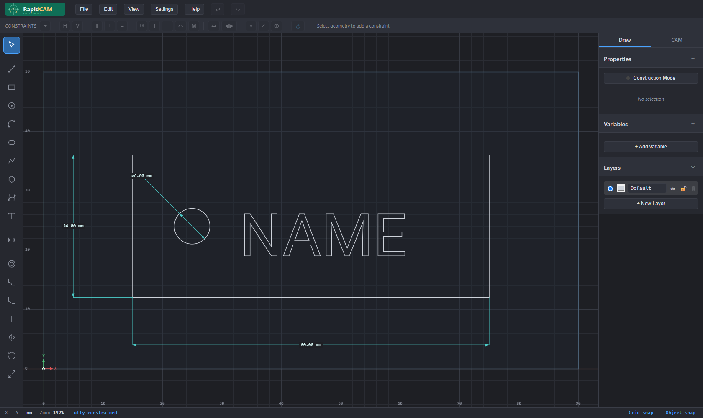
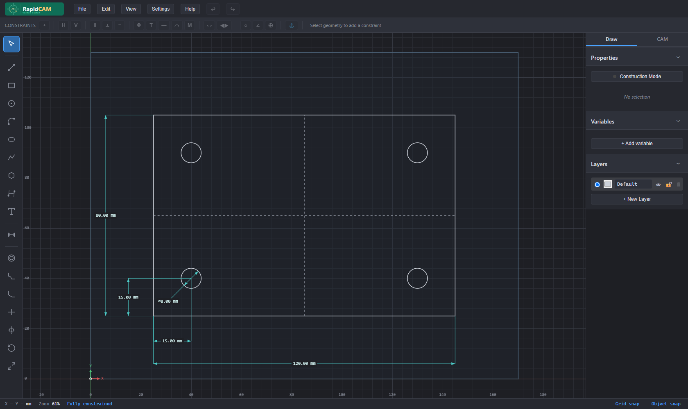
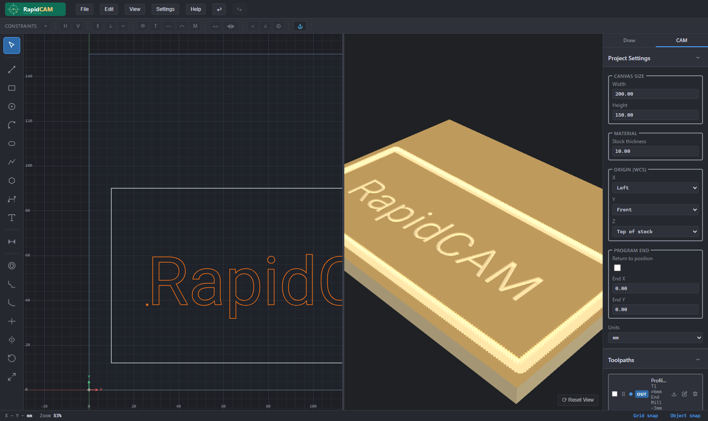

# RapidCAM

**Open-source CAD/CAM for desktop CNC — right in your browser.**

Sketch a part, lock it down with real parametric constraints, generate toolpaths, and export GRBL or LinuxCNC G-code. No install, no account, no upload — your designs and G-code never leave your browser.

### 👉 [Try it now at rapidcam.app](https://rapidcam.app) — nothing to install

https://github.com/user-attachments/assets/c4c5327a-c474-4d0b-95a6-56a732f8f3a5

| Sketch editor | Constraint solver | CAM toolpaths |
|---|---|---|
|  |  |  |

**Why RapidCAM?**

- **Runs anywhere** — it's a web app. Open it on any machine, no setup.
- **Truly parametric** — a Levenberg-Marquardt constraint solver with driving dimensions and variables. Type a variable formula straight into a property field (a circle's radius, a line's length, an image's size/angle…), reference variables from other variables, and constrain engrave images to the geometry around them — so edits stay consistent (not just a drawing program).
- **From sketch to G-code in one place** — profile, pocket, engrave, drill, and V-carve toolpaths with a 3D cut preview; **laser** cut/engrave output (including **photo/greyscale raster engraving**) with a flat path preview; **CNC relief carving** that turns a greyscale image into 2.5-D depth; and a **rotary 4th-axis** machine type that wraps any milling job around a cylinder.
- **Private by default** — all processing is local; your files stay on your machine. Analytics is opt-in only.
- **Open source** — AGPL-3.0, with a commercial license available.

---

## Feature overview

### Drawing tools

| Tool | Key | Description |
|------|-----|-------------|
| Select | `V` | Click/drag to select; move, resize, or rotate selected entities |
| Line | `L` | Click two points **or drag**; chains automatically |
| Rectangle | `R` | Click two corners **or drag one out**; hold `Alt` to draw from the centre |
| Circle | `C` | Click centre then a point on the circumference, **or drag out from the centre** |
| Arc | `A` | Click centre, start, end |
| Slot | `U` | Click two centre points; auto-constrains the two arc caps |
| Polygon | `N` | Click centre then a vertex **or drag out**; `[`/`]` change side count |
| Polyline | `P` | Click vertices; `Enter` to close; open or closed |
| Bezier | `B` | Click four control points (cubic) |
| Text | — | Click to place; double-click to edit in place; outlines can be profiled, pocketed, engraved, or **v-carved**. Fonts come from the bundled pair, a local `.ttf`/`.otf`/`.woff`, or the web — search Google's families in the picker — and are embedded in the project file |
| Dimension | `D` | Click anywhere on two things, then click to place. What you pick decides what it measures: two points give a distance (or Δx/Δy, from which way you drag), a point and an edge the **perpendicular** distance, two parallel edges the gap, two crossing edges the **angle**. Pick one thing and click open space for its own size — a length, or a circle's **diameter** (`Tab` for radius, or a line's angle from horizontal). Drag a placed dimension to reposition it |
| Offset | `O` | Click an entity to offset inward or outward |
| Fillet | `F` | Click a sharp corner to round it with a user-typed radius |
| Chamfer | — | Click a sharp corner to bevel it with a user-typed distance |
| Trim | `T` | Click the segment to remove at an intersection |
| Mirror | `M` | Reflect selected entities across a picked axis line |
| Rotate | `Q` | Rotate selected entities by angle around a pivot |
| Scale | `S` | Scale selected entities by factor around a pivot |

### Parametric constraint solver

RapidCAM uses a **Levenberg-Marquardt** solver with Tikhonov regularisation. Non-pinned degrees of freedom are always anchored so that editing a driving dimension produces a minimal-movement solution (no unexpected rotations).

**Available constraints** (applied from the constraint bar or automatically by tools):

- Coincident — two points share the same location
- Horizontal / Vertical — line is axis-aligned
- Parallel / Perpendicular / Collinear — angular relationships between lines
- Equal — two lengths or radii are equal
- Symmetric — entity mirrored about a line
- Midpoint — point lies at the midpoint of a line
- Fixed — entity is locked to the world frame
- Tangent — circle/arc is tangent to a line or another arc
- Point on Line / Point on Arc / Point on Circle
- Concentric
- Angle — angular constraint between two lines

Line-type constraints (horizontal, vertical, parallel, perpendicular, collinear, equal, angle, tangent, point-on-line) also apply to **individual polyline segments** — click a segment in the select tool to constrain it like a standalone line, without exploding the polyline. Tangents to an *arc* are solved against its full circle (standard CAD behaviour); if the contact point falls outside the arc's sweep the constraint bar shows a non-blocking warning.

**Engrave images can be positioned by constraints** too — an image exposes its four corners and centre as snap/pick points, so you can make a corner *coincident* with a hole, centre it on a point, or put a corner *on* a line/circle, and the image reflows to follow. By default an image is a rigid body, so a point constraint *translates* it and positioning never distorts it. Its Properties panel says what constraints **may** change about it — **resize**, **rotate**, both, or neither — with **Lock aspect** deciding whether a resize stays uniform (that one checkbox now governs the solver as well as typed edits). The main use is **calibrating a scan**: allow resize, dimension a feature of known size on the image, and the whole image scales to match with the aspect ratio exact. Grant only the freedom you need — each spare one is another way for the solver to satisfy a constraint wrongly (tilting the image to meet a size, or shrinking it away to meet an angle).

**Text exposes its box** — the ink-box corners, edge midpoints and centre — as snap/pick points too, so you can dimension a text block's size or its distance from an edge. Editing the string keeps those relationships live.

### Align / Center

The **Align** toolbar (and the right-click menu) centres the selected item(s) inside a container in one click — **Center H**, **Center V**, or **Center** (both). Select the thing to move plus the shape to centre it in (a rectangle — including one drawn as four lines — a circle, or another block) and click. It's **fully live but one-way**: the mover re-centres as you edit it *and* follows the container if you move or resize it, while the container itself never moves. (Under the hood it's a directional `center` constraint; delete it to un-centre.)

**DOF-based entity colouring:** After each solve, every entity is coloured by its constraint status — **blue** = under-defined (free DOFs remain), **normal** = fully defined, **red** = over-constrained or conflicting. The analysis uses RREF null-space decomposition so that mutual dependencies between entities are handled correctly.

### Driving dimensions vs. reference dimensions

Driving dimensions change the geometry when edited (shown in cyan). Reference (driven) dimensions display the measured value in grey, wrapped in parentheses: `(50.00 mm)`. Toggle between the two modes in the dimension inspector.

### Variables & formula fields

Named variables (`pitch`, `diameter`, …) can be defined in the Variables panel and used in any dimension value field, pattern count/spacing field, or property field. Expressions like `pitch * 2` are evaluated at solve time, and a **variable may reference other variables** (`margin = width * 0.1`), resolved in dependency order (reference cycles are detected, not looped). The global material thickness is always available as `stock` (or `$stock`), alongside built-in keywords for the blank (`stock_width`/`stock_height`), the work area (`sheet_width`/`sheet_height`), the WCS origin (`origin_x`/`origin_y`/`origin_z`), `pi`/`e`, and a serial `counter` — and a user variable of the same name overrides a built-in.

You can also type a formula **directly into a scalar property field** — a circle's radius, an arc's radius/angles, a line's length, a rectangle's W/H, an image's width/height/angle — instead of adding a dimension. A driven field shows an **ƒx** badge (click to unbind, or type a plain number to go back to a literal); it's fed to the *same* constraint solver as dimensions, so formulas and geometric constraints reconcile through one channel. If a formula's variable is later deleted, the field turns **red** (and the badge a **⚠**) rather than silently holding a stale value.

### Parametric patterns

- **Linear pattern** — copies geometry in an X/Y grid; **Circular pattern** — copies around a centre point over a total angle
- **Count *and* spacing accept variable expressions** (e.g. a `tabs` variable, or `pitch * 2`), so a variable can drive how *many* copies exist, not just where they sit
- Patterns **regenerate automatically** when a driving variable changes — whether it changes the *count* (bump `tabs` from 6 to 10) or moves the *source* geometry (a `pcd` that drives the master's position) — preserving existing copies' identity along with any constraints/dimensions on them (dragging source geometry by hand instead flags the pattern for **Edit → Regenerate Patterns**)
- **CAM toolpaths follow patterns** — assign a profile, drill, etc. to the master and every copy is cut, tracking the count as it changes

### Layers

Entities live on named, coloured, show/hide layers. Construction geometry (dashed) is kept on separate layers and excluded from CAM operations.

On a **laser** document a layer can also carry the beam settings for everything on it — power, speed, passes, and what the geometry is *for* (cut / score / engrave / filled engrave). That makes the colour-driven workflow the whole job: see [Laser jobs from layers](#laser-jobs-from-layers).

### Laser jobs from layers

Laser work is colour-driven — cut on black, score on red, engrave on blue — so on
a laser document each layer can carry its own beam settings and say what its
geometry is *for*:

| On the layer | Meaning |
|---|---|
| **Job type** | Cut, Score, Engrave, or Engrave (filled) — or *tuning only*, a layer that sets power for the toolpaths cutting it without being a job itself |
| **Power / speed / passes** | Beam percentage, feed, and how many times each path is re-traced |
| **Kerf** | Auto by default (see below), or forced outside/inside for an inlay or press fit |

Press **Toolpaths from Layers** in the CAM panel and the drawing becomes a
program: one toolpath per layer, in layer order, named after the layer. Hidden
layers and workholding layers are skipped, and you're told which and why.

Power, speed and passes stay **live** — re-tune a layer after a test cut and
every toolpath cutting it follows, no rebuild needed. The job *type* is
deliberately not live: a cut, an engrave and a fill emit fundamentally different
geometry, so changing a type doesn't silently retype toolpaths you've already
previewed. Change it and rebuild.

Kerf compensation has a direction. To finish at the size you drew, the beam runs
**outside** an outline and **inside** a hole — so a kerf-compensated cut layer
containing holes builds two toolpaths, holes first (which is also how you'd run
it by hand: cut the interior while the part is still held by the sheet).

### CAM

| Feature | Details |
|---------|---------|
| Profile cut | Contour-follows any closed chain; inside/outside, tabs, dogbone/T-bone corner reliefs, lead-in / lead-out arcs, optional full-depth finishing pass. Curved profiles post as smooth `G2`/`G3` (arc-fitted) instead of faceted G1 |
| Pocket clearing | Three strategies: **offset** (default) — concentric contour-parallel loops that wrap islands with helical entry and no per-row lifting; **adaptive** — the same loops with trochoidal circles wherever the cutter would be buried deeper than a straight stepover, holding the load down at the cost of a longer path; or classic **zig-zag raster**. All respect islands and flood-fill region picking; optional finishing pass |
| Facing / surfacing | Skim the top of the blank — or the spoilboard — flat. No geometry needed: the extent comes from the job. The cutter runs a full radius past every edge (what a pocket over a rectangle can't do), rows alternate with no lift, and a spoilboard pass is zeroed on the board, banners its setup, and is refused in the same program as cutting toolpaths |
| Rest machining | A pocket can clear only what a larger, earlier tool left standing — its corner radii and any channel it couldn't enter — by naming that tool's diameter. Works with every clearing strategy |
| Engrave | Follows geometry on its centreline at depth (lines, arcs, beziers, text); standalone arcs/beziers emit native `G2`/`G3` |
| Relief carving (mill) | Carve a **greyscale image** as 2.5-D depth with a ball-nose (or V-bit): each pixel's darkness becomes Z depth (darkest = cut depth, white = surface), swept as continuous scan rows reached over stepdown passes. Tone curve (gamma), stepover scaled to the bit, invert, and a live cut-time estimate; rendered in the 3D preview |
| Relief roughing (mill) | Hog out the bulk of a relief first: a coarse flat/bull tool clears the image in flat **Z-levels** down to a **finish allowance**, ramping into each cut, so the ball-nose finish pass only skims the last of the material — making *deep* reliefs practical. Runs before the relief-carve (finish) op with its own tool; warns if it would gouge below the finish surface |
| V-carve | Variable-depth carving with a V-bit — depth tracks distance from the wall so strokes taper to a sharp spine, clamped to a max depth. Carves text (counters become holes) and flood-fill regions (with islands); shown in the 3D preview |
| Chamfer | Bevels an edge with a V-bit by **width**; plunge depth derived from the bit angle, with an optional sharp-corner lift |
| Drill | Plunge at points / circle centres; optional G83-style peck retract |
| Tabs / bridges | Automatic tab insertion on profile cuts |
| Two-sided (flip) | Machine both faces from one drawing: tag each toolpath **Top** or **Bottom**, then export a **side-A** program (top ops, ending with **registration dowel-pin holes** bored through the stock into the spoilboard) and a **side-B** program whose geometry is mirrored about the flip axis so features line up through the part after you flip the stock onto the pins. Mirroring is done at the entity level, so leads/tabs/dogbones/T-bones/climb come out correct on the reverse, and bottom-face text engraves mirror-imaged. Guards asymmetric pins, an unsuitable boring tool, and a through-cut that would free the part before the flip. Preview either face with an A/B toggle in the 3D view |
| Rotary / 4th axis | Switch the machine type to **CNC Mill — Rotary / 4th axis** to machine around a cylinder (spoil rods, columns, rolling pins, pens). The canvas becomes the **unrolled cylinder surface** — set the stock as Length × Diameter and the wrapped dimension locks to π·diameter, so a straight line across the wrap cuts a **ring** and a diagonal cuts a **helix**. Every toolpath type works unchanged; at export the flat program is wrapped, posting the wrapped axis as **A/B rotary degrees** with **G93 inverse-time feed** so combined linear+rotary moves hold the commanded surface speed. Choose the **Z0 reference** — the **stock surface** (touch off the cylinder top) or the **rotary centre** (axis of rotation); centre-zeroing lines up with gSender's native rotary preview with no extra toggle. The flat canvas carries a **wrap hint** — a degree ruler down the wrapped axis, quarter-turn guides, the seam edges, and the A0 line (which follows the **work origin**, so a centred origin reads −180°…+180°); toggle it from **View ▸ Rotary Wrap Hint** |
| Stock & workholding | Place the stock blank anywhere inside a larger machine work area (the WCS origin follows the blank), and flag layers as **fixtures**: closed shapes on a fixture layer are clamps — drawn amber-dashed, never machined, with an optional clamp height — and the pre-flight check flags any move that would hit one |
| Tool library | Named tool definitions with diameter, V-bit angle, feed/speed presets |
| Laser output | Switch the machine type to **laser** for fixed-Z beam output: vector **cut** (optional kerf compensation), vector **engrave**, and low-power **score/fold** lines, plus **area-fill engrave** (scan-line flood of closed shapes, counters left clear) and **greyscale raster engrave** of an imported image (sweeps the photo as scan rows, modulating beam power per pixel — darker = more power — with invert and overscan). Power (%) + pass count instead of spindle/Z. Pick a laser controller — GRBL/FluidNC (`M4` dynamic or `M3` constant), Marlin, Smoothieware, or LinuxCNC (PWM spindle) — each an editable post in `src/cam/laserposts/`. Per-op air assist (M8/M9). Power and speed can live **on the layer** instead of on each toolpath, so the whole job is described by colour and built in one press — see [Laser jobs from layers](#laser-jobs-from-layers). A built-in **Material Test** generator sweeps power × speed across a labelled grid so you can dial in settings for a new material. Reuses the same geometry as milling; designed so waterjet/plasma can slot in later | A **rotary** laser (tumblers, bottles, pens, bats) is its own machine type — **Laser — Rotary (cylinder)** — which brings the cylinder stock model, the wrap hint and the carved-cylinder preview to the beam. It posts by **axis substitution**: the wrapped axis stays an ordinary linear word in surface millimetres and the program carries a banner stating what one revolution must measure (set the rotary's steps/mm from it), because GRBL — which drives most laser rotaries — has no 4th axis to send degrees to |
| G-code export | GRBL and LinuxCNC post-processors (mill) / selectable laser controllers (laser); post per-operation or a ticked subset to one file; per-op coolant (`M7`/`M8`) and machine-wide custom start/end blocks |
| Pre-flight checks | Every export or send lints the posted program first and confirms before writing anything: rapids travelling sideways below the stock top, moves outside the stock while engaged, cuts below the stock bottom, straight plunges at cutting feed, a manual tool change with no pause, and fixture/clamp collisions |
| Send G-code | Post the program straight to a running **gSender** or **ncSender** over its local API instead of downloading — including both sides of a two-sided job in sequence — or open it in **GEditor** ([editor.rapidcam.app](https://editor.rapidcam.app)) to read, edit and 3D-simulate it first |
| Toolpath preview | 3D WebGL stock simulation of the cut (profile, pocket, engrave, v-carve, chamfer, drill, image relief + relief roughing — showing the true tool-envelope). A **rotary** job renders the carved stock as a **cylinder** — the engraving wraps around the dowel and you can orbit right under it; laser documents instead show a flat on-canvas preview of the beam cut paths |

> **Open vs. closed geometry:** Engrave cuts follow any path on its centreline, including standalone arcs and beziers (emitted as native `G2`/`G3` arcs where possible). Profile and pocket operations require *closed* geometry — a lone arc, line, open polyline, or bezier is skipped with an explanatory `; NOTE:` in the G-code rather than silently dropped. Combine segments into a closed loop (or use a closed polyline / region pick) to profile or pocket them.

### File I/O

- **Native project format** — JSON snapshot with full document state (undo history preserved across sessions); embeds used fonts and **image pixels** so a saved job reproduces (and cuts) identically on any machine
- **SVG import/export** — round-trips clean paths; exported SVG preserves layer colours
- **DXF import** — **File → Import DXF** reads LINE, CIRCLE, ARC, POINT, LWPOLYLINE and legacy POLYLINE (bulged segments become **true arcs**, not tessellation), SPLINE and ELLIPSE (tessellated), and INSERT block references with rotation/scale; honours `$INSUNITS` (inch files scale to mm automatically), and **asks which units a file that declares none is in** — showing the resulting size both ways — rather than assuming millimetres and landing an inch drawing 25.4× too small; anything unsupported is skipped with a summary rather than silently dropped
- **DXF export** — **File → Export DXF** writes true arcs, splines (béziers stay exact NURBS curves), closed polylines, and text as engraveable outline polylines, with layer names preserved — for handoff to LightBurn, QCAD, LibreCAD, Fusion, or a laser-cutting service
- **Image import** — **File → Import Image…** places a photo (PNG/JPEG/…) on the canvas as a sized, movable raster for laser raster engraving or CNC relief carving (downscaled and stored greyscale)

---

## Architecture

```
src/
├── app.ts              # Application shell — wires everything together
├── main.ts             # Entry point
├── style.css           # Dark-theme CSS
│
├── core/               # Pure math utilities
│   ├── vec2.ts         # 2-D vector operations
│   ├── units.ts        # mm ↔ display-unit conversion
│   ├── expr.ts         # Variable expression evaluator
│   ├── transform.ts    # Translate / rotate / scale helpers
│   ├── fontManager.ts  # opentype.js wrapper
│   └── imageManager.ts # Imported raster images (greyscale, embedded in .rcam)
│
├── model/              # Document data model (no rendering, no DOM)
│   ├── document.ts     # CADDocument class — entities, constraints, dimensions, undo
│   ├── entities.ts     # Entity classes (Line, Circle, Arc, Polyline, …)
│   ├── constraints.ts  # Constraint definitions and residual functions
│   ├── dimensions.ts   # Dimension layout and residuals
│   ├── variables.ts    # Named variable evaluation
│   ├── patterns.ts     # PatternDef — linear & circular parametric patterns
│   └── history.ts      # Snapshot-based undo / redo
│
├── solver/             # Geometric constraint solver
│   ├── solver.ts       # Levenberg-Marquardt + DOF status computation
│   └── linalg.ts       # Gaussian elimination, RREF, matrixRank
│
├── view/               # Canvas rendering (no model mutation)
│   ├── renderer.ts     # Main draw loop — entities, dimensions, constraints
│   ├── viewport.ts     # World ↔ screen transform, zoom/pan
│   ├── colors.ts       # Central colour palette
│   ├── grid.ts         # Adaptive grid
│   ├── rotaryOverlay.ts # Rotary wrap hint (degree ruler, seams) as pure data
│   └── overlay.ts      # Transient visuals (snap, preview, selection rect)
│
├── input/              # User input
│   └── snapping.ts     # Snap engine (endpoints, midpoints, intersections, grid)
│
├── tools/              # One file per drawing/editing tool
│   ├── tool.ts         # Tool interface + ToolManager
│   ├── selectTool.ts
│   ├── lineTool.ts     # … (one file per tool)
│   └── icons.ts        # Inline SVG icons (24×24)
│
├── ui/                 # UI panels — toolbar, bars, dialogs
│   ├── toolPalette.ts
│   ├── constraintBar.ts
│   ├── camBar.ts          # Toolpath list + Add/Edit Toolpath dialog
│   ├── camBarHelpers.ts   # Pure CAM helpers (op matching, region seeding)
│   ├── statusBar.ts
│   └── …
│
├── cam/                # CAM operations
│   ├── types.ts        # CamOperation, ToolDef
│   ├── clearing.ts     # Contour-parallel (offset) pocket clearing
│   ├── pocket.ts       # Raster (zig-zag) pocket scanline
│   ├── loops.ts        # Closed-loop detection (lines/arcs/beziers → polygons)
│   ├── regions.ts      # Flood-fill region picking (Clipper2 booleans)
│   ├── offset.ts       # Contour offsetting (via Clipper2)
│   ├── vcarve.ts       # V-carve offset-peeling solver (variable depth)
│   ├── rasterEngrave.ts # Image → scan-line level grid (laser raster + mill relief)
│   ├── arcfit.ts       # Arc-fit profile polylines → G2/G3
│   ├── tabs.ts         # Tab/bridge insertion
│   ├── gcode.ts        # G-code builder (mill; dispatches to laser by machineKind)
│   ├── lasergcode.ts   # Laser/fixed-Z beam G-code + flat preview paths
│   ├── laserposts/     # Per-controller laser post-processors (GRBL M4/M3, Marlin, Smoothie, LinuxCNC)
│   ├── klein.ts        # Rotary/4th-axis wrap (flat program → A/B degrees, G93)
│   ├── flip.ts         # Two-sided machining (mirrored side-B program, dowel pins)
│   ├── lint.ts         # Pre-flight G-code checks (gates export)
│   ├── fixtures.ts     # Fixture-layer footprints for the clamp-collision check
│   ├── stockRasterizer.ts # Height-field stock sim for the 3D preview
│   ├── toolLibrary.ts
│   └── postprocessors/ # GRBL, LinuxCNC
│
└── io/                 # File I/O
    ├── fileio.ts
    ├── svgImport.ts
    ├── svgExport.ts
    ├── dxfImport.ts    # ASCII DXF parser (bulges → true arcs, blocks, NURBS splines)
    ├── dxfExport.ts    # Minimal AC1015 writer (arcs, splines, text outlines)
    ├── gsender.ts      # "Send to gSender" handoff (POST to its local API)
    ├── ncsender.ts     # "Send to ncSender" handoff (POST to its local API)
    ├── geditor.ts      # "Open in GEditor" handoff (window handshake, editor.rapidcam.app)
    ├── examples.ts     # Bundled example projects (inlined from examples/)
    └── projectManager.ts
```

**Coordinate system:** All geometry is stored in millimetres with Y-up (standard mathematical convention). The renderer flips Y when converting to screen space.

**Internal units:** The solver and all constraint residuals always work in mm. Display units (mm / inch) are applied only at the UI layer.

---

## Getting started

### Prerequisites

- [Node.js](https://nodejs.org/) 20.19+ (or 22.12+) — required by Vite 8
- npm (bundled with Node)

### Install and run

```bash
git clone https://github.com/jennib/rapidcam.git
cd rapidcam
npm install
npm run dev        # starts Vite dev server at http://localhost:5173
```

### Other scripts

```bash
npm run typecheck  # TypeScript type check (no emit)
npm test           # run all tests via vitest
npm run build      # type check + Vite production build → dist/
npm run preview    # serve the dist/ build locally
npm run validate   # type check + tests + production build
```

---

## File format

Projects are saved as `.rcam` files — plain JSON, all lengths in millimetres,
Y-up. The current format is **version 3** (version-1 and version-2 files open and
are upgraded automatically). It's documented for external tooling:

- [`docs/rcam-format-v3.md`](docs/rcam-format-v3.md) — authoring guide (entity
  point-key vocabularies, constraint/dimension semantics, CAM operations, gotchas).
- [`public/schema/rcam-v3.schema.json`](public/schema/rcam-v3.schema.json) — machine-readable
  JSON Schema (draft 2020-12) for validating generated files. Published at its
  canonical URL **https://rapidcam.app/schema/rcam-v3.schema.json**.

Both are kept honest by a drift-guard test that validates every bundled
[example](examples/) against the schema (`npm test -- rcam-schema`).

---

## AI integration

The `.rcam` format is designed so LLMs can author real, machinable designs,
and RapidCAM meets them at every level — full details, tool references, and
authoring tips in **[docs/ai-integration.md](docs/ai-integration.md)**:

- **In the app** — **File ▸ AI Assistant** copies a self-contained prompt
  (your machine, stock, tool library, and the full format guide) into any AI
  chat, then checks the pasted result end-to-end — schema, loader, references,
  constraint solve, work-area bounds, and a G-code dry-run that catches
  operations that would cut nothing and runs the Apollo pre-flight lint
  (out-of-bounds toolpaths, over-deep cuts, fast plunges, missing tool-change
  pauses) on the real machine program(s), reported as warnings. Failures
  become a one-click **error report** you paste back so the AI fixes its own
  file; a successful import is undoable (Ctrl+Z). Files opened from disk
  (**File ▸ Open**) get the same review — issues appear in a dialog with the
  same copyable report.
- **For web-connected AIs** — hand any agent the single URL
  [`https://rapidcam.app/llms.txt`](public/llms.txt): it indexes the format
  guide, schema, examples, and AI guide at stable URLs. (The app homepage's
  HTML also points AI readers there, so agents find it on their own.)
- **Headless CLI** — `npm run cli -- validate|post|render|open|decode`
  runs the same pipeline from a script or agent, including PNG rendering via
  headless Chromium, `open`, which delivers a validated design straight
  into the user's browser via a share link, and `decode`, which turns a
  copied share link back into `.rcam` JSON so an agent can read and modify
  the user's current design.
- **MCP server** — `claude mcp add rapidcam -- npx tsx mcp/server.ts` gives
  MCP clients (Claude Code, Claude Desktop, …) the full author → validate →
  post → *look at a render* → *open in the user's browser* loop as tools.

---

## Privacy & analytics

RapidCAM can collect anonymous usage analytics (via PostHog) to help guide development, but **only with your explicit consent**:

- On first visit you'll see a small banner; nothing is sent unless you choose **Allow analytics**.
- Browsers with **Do Not Track** enabled are never tracked and never shown the banner.
- Your choice is stored locally and can be changed at any time from **Help → Privacy & Analytics** (or cleared entirely via site data / the `rapidcam_analytics_consent` localStorage key to be asked again). Turning a consent off there takes effect immediately.
- By default, analytics records only coarse interaction events (e.g. "tool activated", "g-code generated"). Your G-code and project files never leave the browser.
- **Session replay is a separate, opt-in-only choice.** The banner has an extra checkbox — left **unchecked** by default — that, if you tick it, enables session replay. Because the drawing lives in a `<canvas>`, replay captures the **pixels of your on-screen drawing** (throttled, low-quality) so geometry is visible in replays. Leave it unchecked to keep your geometry off our servers. It's stored separately (`rapidcam_analytics_replay_consent`) and is never enabled just because you allowed usage analytics.

The self-hosted build collects nothing unless you wire up your own PostHog key.

---

## Contributing

See [CONTRIBUTING.md](CONTRIBUTING.md) for the full guide. The short version:

1. Fork the repo and create a feature branch.
2. Make your changes — keep them focused and minimal.
3. Run `npm run typecheck` and confirm it passes with no errors.
4. Open a pull request against `main`.

**License note:** This project is licensed under [AGPL-3.0](LICENSE). By submitting a contribution you agree to license it under the same terms. The author also reserves the right to offer the project under separate commercial terms (dual licensing).

---

## License

[](https://www.gnu.org/licenses/agpl-3.0)

RapidCAM is licensed under the **GNU Affero General Public License v3.0**.

You are free to use, study, modify, and share it. If you distribute it — or run a modified version as a network/hosted service — you must make the complete corresponding source code available to your users under the same license.

Want to use RapidCAM without these obligations (e.g. to host it commercially)? A separate commercial license is available — contact the author.

See [LICENSE](LICENSE) for the full legal text.
